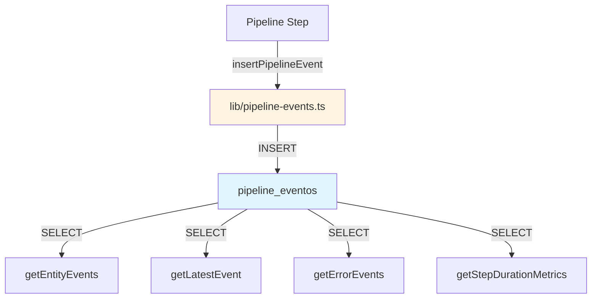

# Resumen del Starter Kit

**Versión:** 1.0  
**Fecha:** 27 de marzo de 2026  
**Propósito:** Resumen rápido del Sistema de Auditoría de Eventos para Cloudflare D1

---

## 📦 Contenido del Starter Kit

| Archivo | Propósito |
|---------|-----------|
| [`README.md`](README.md) | Resumen ejecutivo y descripción general |
| [`01-guia-implementacion.md`](01-guia-implementacion.md) | Guía paso a paso para incorporar al proyecto |
| [`02-schema-sql.md`](02-schema-sql.md) | Schema SQL de la tabla `pipeline_eventos` |
| [`03-types.md`](03-types.md) | Tipos TypeScript para type-safety |
| [`04-lib-pipeline-events.md`](04-lib-pipeline-events.md) | Librería de funciones (escritura y lectura) |
| [`05-migracion.md`](05-migracion.md) | Script de migración desde schema acoplado |

---

## 🚀 Quick Start

### 1. Crear la Tabla

Ejecuta el SQL de [`02-schema-sql.md`](02-schema-sql.md) en tu base de datos D1:

```bash
npx wrangler d1 execute <TU_DATABASE> --file=<(cat <<'EOF'
CREATE TABLE IF NOT EXISTS pipeline_eventos (
  id INTEGER PRIMARY KEY,
  entity_id TEXT NOT NULL,
  entity_ref INTEGER,
  paso TEXT NOT NULL,
  nivel TEXT NOT NULL CHECK(nivel IN ('DEBUG','INFO','WARN','ERROR')),
  tipo_evento TEXT NOT NULL,
  origen TEXT,
  error_codigo TEXT,
  detalle TEXT,
  duracion_ms INTEGER,
  created_at TEXT NOT NULL DEFAULT (datetime('now'))
);

CREATE INDEX IF NOT EXISTS idx_pe_entity_id ON pipeline_eventos(entity_id);
CREATE INDEX IF NOT EXISTS idx_pe_error ON pipeline_eventos(error_codigo);
CREATE INDEX IF NOT EXISTS idx_pe_paso_nivel ON pipeline_eventos(paso, nivel);
EOF
)
```

### 2. Copiar Archivos al Proyecto

```bash
# Crear estructura de carpetas
mkdir -p src/types src/lib

# Copiar tipos (ajusta rutas según tu proyecto)
# Crea src/types/pipeline-events.ts con el contenido de 03-types.md

# Copiar librería (ajusta rutas según tu proyecto)
# Crea src/lib/pipeline-events.ts con el contenido de 04-lib-pipeline-events.md
```

### 3. Usar en tu Código

```typescript
import { insertPipelineEvent, getEntityEvents } from './lib/pipeline-events'

// Registrar evento
await insertPipelineEvent(db, {
  entityId: 'process-uuid-123',
  paso: 'PROCESS_DATA',
  nivel: 'INFO',
  tipoEvento: 'STEP_SUCCESS',
  detalle: { records: 150 },
  duracionMs: 2500,
})

// Consultar eventos
const eventos = await getEntityEvents(db, 'process-uuid-123', {
  order: 'DESC',
  limit: 100,
})
```

---

## 📋 Referencia Rápida

### Niveles de Evento

| Nivel | Uso |
|-------|-----|
| `DEBUG` | Información detallada para desarrollo |
| `INFO` | Eventos de éxito normales |
| `WARN` | Errores no terminales o situaciones anómalas |
| `ERROR` | Errores terminales |

### Tipos de Evento (Sugeridos)

| Tipo | Uso |
|------|-----|
| `PROCESS_START` | Inicio del proceso |
| `PROCESS_COMPLETE` | Proceso completado exitosamente |
| `PROCESS_FAILED` | Proceso falló |
| `STEP_SUCCESS` | Paso completado exitosamente |
| `STEP_FAILED` | Paso falló (con reintento o terminal) |
| `STEP_ERROR` | Error de negocio detectado |

### Funciones Principales

| Función | Propósito |
|---------|-----------|
| `insertPipelineEvent()` | Registrar un nuevo evento |
| `getEntityEvents()` | Obtener cronología de una entidad |
| `getLatestEvent()` | Obtener último evento de una entidad |
| `getErrorEvents()` | Obtener eventos con error |
| `getStepDurationMetrics()` | Obtener métricas de duración por paso |
| `getEventCountByType()` | Obtener conteo de eventos por tipo |
| `getLatestEventsByMultipleEntities()` | Obtener últimos eventos de múltiples entidades |
| `deleteOldEvents()` | ⚠️ Eliminar eventos antiguos (destructivo) |

---

## 📁 Estructura de Archivos Sugerida

```
tu-proyecto/
├── src/
│   ├── types/
│   │   └── pipeline-events.ts      # Copiado de 03-types.md
│   └── lib/
│       └── pipeline-events.ts      # Copiado de 04-lib-pipeline-events.md
└── migrations/
    └── 001-create-pipeline-events.sql  # Copiado de 02-schema-sql.md
```

---

## 🔗 Diagrama de Arquitectura



---

## ✅ Checklist de Implementación

- [ ] Crear la tabla `pipeline_eventos` en D1
- [ ] Copiar tipos TypeScript al proyecto
- [ ] Copiar librería al proyecto
- [ ] Ajustar rutas de importación
- [ ] Integrar `insertPipelineEvent` en el pipeline
- [ ] Definir convenciones de nombres para `paso`
- [ ] Definir taxonomía de `error_codigo`
- [ ] Probar con datos reales
- [ ] Definir política de retención

---

## 📚 Documentación Adicional

- Para implementación detallada, ver [`01-guia-implementacion.md`](01-guia-implementacion.md)
- Para detalles del schema, ver [`02-schema-sql.md`](02-schema-sql.md)
- Para referencia de tipos, ver [`03-types.md`](03-types.md)
- Para referencia de funciones, ver [`04-lib-pipeline-events.md`](04-lib-pipeline-events.md)
- Para migración desde schema acoplado, ver [`05-migracion.md`](05-migracion.md)

---

## ⚠️ Consideraciones Importantes

1. **Append-only:** La tabla es append-only (solo INSERT, nunca UPDATE ni DELETE)
2. **Índices:** Se crean 3 índices por defecto para optimizar consultas
3. **Volumen:** Considerar política de retención (~1000 eventos/día estimados)
4. **Particionamiento:** Si el volumen supera 1M eventos, considerar particionamiento por fecha

---

**Fin del Resumen**
