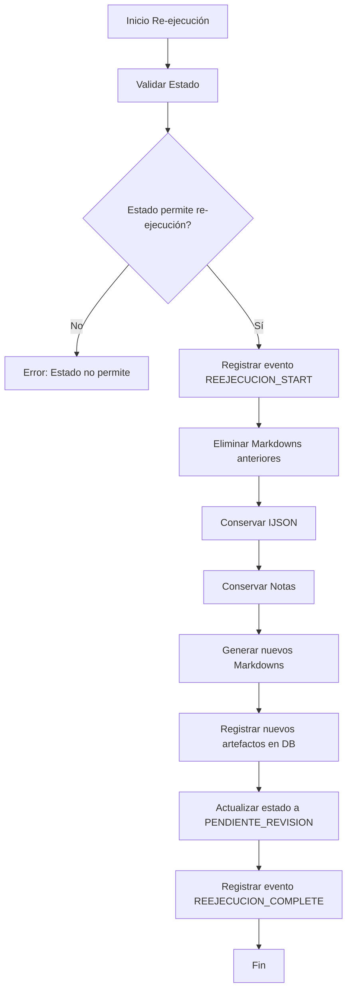
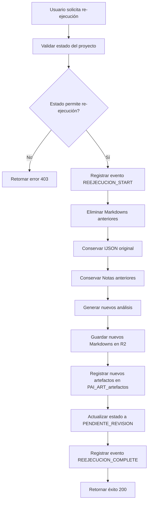

# Especificación de Re-ejecución de Análisis - Proyectos PAI
## Backend - Core Funcional

**Versión:** 1.0
**Fecha:** 27 de marzo de 2026
**Propósito:** Especificación del comportamiento de re-ejecución de análisis para proyectos PAI

---

## Índice

1. [Propósito](#1-propósito)
2. [Criterios para Permitir Re-ejecución](#2-criterios-para-permitir-re-ejecución)
3. [Estrategia de Preservación de Artefactos](#3-estrategia-de-preservación-de-artefactos)
4. [Manejo de Notas Asociadas](#4-manejo-de-notas-asociadas)
5. [Actualización de Trazabilidad](#5-actualización-de-trazabilidad)
6. [Flujo de Re-ejecución](#6-flujo-de-re-ejecución)
7. [Referencias](#7-referencias)

---

## 1. Propósito

Este documento define el comportamiento de re-ejecución de análisis para proyectos PAI, incluyendo:

- Criterios para permitir re-ejecución
- Estrategia de preservación de artefactos
- Manejo de notas asociadas a análisis anteriores
- Actualización de trazabilidad con el sistema de pipeline events

La re-ejecución permite al usuario volver a ejecutar el análisis de un proyecto, generando nuevos artefactos mientras se preserva el contexto del trabajo anterior.

---

## 2. Criterios para Permitir Re-ejecución

### 2.1. Estados que Permiten Re-ejecución

Un análisis puede re-ejecutarse solo si el proyecto está en uno de los siguientes estados:

| Estado ID | Estado | Descripción |
|-----------|-------|-------------|
| 3 | `PENDIENTE_REVISION` | Análisis finalizado, esperando revisión humana |
| 5 | `EVALUANDO_VIABILIDAD` | En evaluación de viabilidad |
| 6 | `EVALUANDO_PLAN_NEGOCIO` | En evaluación de plan de negocio |
| 7 | `SEGUIMIENTO_COMERCIAL` | En seguimiento comercial |

### 2.2. Estados que NO Permiten Re-ejecución

Un análisis NO puede re-ejecutarse si el proyecto está en uno de los siguientes estados:

| Estado ID | Estado | Razón |
|-----------|-------|---------|
| 1 | `NUEVO` | Proyecto recién creado, aún sin análisis |
| 2 | `EN_ANALISIS` | Análisis en progreso |
| 4 | `APROBADO` | Proyecto aprobado, no requiere más análisis |
| 8 | `RECHAZADO` | Proyecto rechazado, no requiere más análisis |
| 9 | `ANALISIS_CON_ERROR` | Análisis anterior falló, requiere corrección manual |

### 2.3. Validación de Estado para Re-ejecución

```typescript
interface ValidacionReejecucion {
  permitido: boolean
  razon?: string
}

function validarEstadoParaReejecucion(
  db: D1Database,
  proyectoId: number,
): Promise<ValidacionReejecucion> {
  const proyecto = await db
    .prepare('SELECT estado_id FROM PAI_PRO_proyectos WHERE id = ?')
    .bind(proyectoId)
    .first()
  
  if (!proyecto) {
    return { permitido: false, razon: 'Proyecto no encontrado' }
  }
  
  const estadosPermitidos = [3, 5, 6, 7] // PENDIENTE_REVISION, EVALUANDO_VIABILIDAD, EVALUANDO_PLAN_NEGOCIO, SEGUIMIENTO_COMERCIAL
  const estadosNoPermitidos = [1, 2, 4, 8, 9] // NUEVO, EN_ANALISIS, APROBADO, RECHAZADO, ANALISIS_CON_ERROR
  
  if (estadosNoPermitidos.includes(proyecto.estado_id)) {
    return { permitido: false, razon: 'El estado actual no permite re-ejecución' }
  }
  
  if (estadosPermitidos.includes(proyecto.estado_id)) {
    return { permitido: true }
  }
  
  return { permitido: false, razon: 'Estado desconocido' }
}
```

---

## 3. Estrategia de Preservación de Artefactos

### 3.1. Artefactos a Preservar

Al re-ejecutar un análisis, los siguientes artefactos deben preservarse:

| Artefacto | Descripción | Acción |
|-----------|-------------|---------|
| IJSON original | Archivo JSON del anuncio inmobiliario | NO eliminar |
| Notas asociadas | Notas creadas durante análisis anteriores | NO eliminar |
| Artefactos Markdown | Archivos de análisis generados | ELIMINAR y regenerar |

### 3.2. Flujo de Preservación



### 3.3. Implementación de Preservación

```typescript
async function preservarArtefactos(
  r2Bucket: R2Bucket,
  cii: string,
): Promise<void> {
  // 1. Eliminar solo los Markdowns, conservar IJSON
  const folderStructure = generateProjectFolderStructure(cii)
  
  // Listar todos los objetos en la carpeta
  const listed = await r2Bucket.list({ prefix: folderStructure.projectFolder })
  
  // Eliminar solo archivos .md
  for (const object of listed.objects) {
    if (object.key.endsWith('.md')) {
      await r2Bucket.delete(object.key)
    }
  }
  
  // NOTA: El IJSON (CII.json) se conserva
}
```

---

## 4. Manejo de Notas Asociadas

### 4.1. Política de Notas

Las notas asociadas a un análisis tienen las siguientes reglas:

1. **Preservación** - Las notas creadas durante un análisis se conservan al re-ejecutar
2. **Contexto** - Las notas siempre están asociadas al estado vigente del proyecto en el momento de su creación
3. **No Edición Cruzada** - Una nota creada durante un análisis anterior no puede editarse si el estado del proyecto cambió

### 4.2. Identificación de Notas de Análisis Anterior

Para identificar qué notas pertenecen al análisis anterior:

```typescript
async function obtenerNotasAnalisisAnterior(
  db: D1Database,
  proyectoId: number,
): Promise<Nota[]> {
  // Obtener todos los eventos de cambio de estado
  const eventos = await getEntityEvents(db, `proyecto-${proyectoId}`)
  
  // Encontrar el último cambio de estado a PENDIENTE_REVISION
  const ultimoCambioRevision = [...eventos]
    .reverse()
    .find(e => 
      e.paso === 'cambiar_estado' && 
      e.detalle?.estado_nuevo === 'PENDIENTE_REVISION'
    )
  
  if (!ultimoCambioRevision) {
    // No ha habido análisis anterior, no hay notas que preservar
    return []
  }
  
  // Obtener notas creadas antes de ese cambio de estado
  const notas = await db
    .prepare(`
      SELECT * FROM PAI_NOT_notas
      WHERE proyecto_id = ? AND created_at < ?
      ORDER BY created_at ASC
    `)
    .bind(proyectoId, ultimoCambioRevision.created_at)
    .all()
  
  return notas.results
}
```

### 4.3. Validación de Edición de Notas

Las notas de análisis anterior NO pueden editarse. Esta validación ya está implementada en [`Integracion_Pipeline_Events_PAI.md`](Integracion_Pipeline_Events_PAI.md).

---

## 5. Actualización de Trazabilidad

### 5.1. Eventos a Registrar

Al re-ejecutar un análisis, se deben registrar los siguientes eventos:

| Paso | Tipo Evento | Nivel | Descripción |
|-------|--------------|--------|-------------|
| Validación Estado | `STEP_SUCCESS` | `INFO` | Estado validado para re-ejecución |
| Eliminar Markdowns | `STEP_SUCCESS` | `INFO` | Markdowns de análisis anterior eliminados |
| Generar Nuevos Markdowns | `STEP_SUCCESS` | `INFO` | Nuevos Markdowns generados |
| Registrar Nuevos Artefactos | `STEP_SUCCESS` | `INFO` | Nuevos artefactos registrados en DB |
| Actualizar Estado | `STEP_SUCCESS` | `INFO` | Estado actualizado a PENDIENTE_REVISION |
| Finalización | `PROCESS_COMPLETE` | `INFO` | Re-ejecución completada exitosamente |

### 5.2. Implementación de Trazabilidad

```typescript
async function ejecutarReejecucionConTrazabilidad(
  env: Env,
  db: D1Database,
  proyectoId: number,
  ijson: string,
): Promise<ReejecucionResultado> {
  const entityId = `proyecto-${proyectoId}`
  
  try {
    // 1. Validar estado
    const validacion = await validarEstadoParaReejecucion(db, proyectoId)
    
    if (!validacion.permitido) {
      return {
        exito: false,
        error_codigo: 'ESTADO_NO_PERMITE',
        error_mensaje: validacion.razon,
      }
    }
    
    // 2. Registrar inicio de re-ejecución
    await insertPipelineEvent(db, {
      entityId,
      paso: 'reejecutar_analisis',
      nivel: 'INFO',
      tipoEvento: 'PROCESS_START',
      detalle: 'Iniciando re-ejecución de análisis',
    })
    
    // 3. Validar estado
    await insertPipelineEvent(db, {
      entityId,
      paso: 'validar_estado',
      nivel: 'INFO',
      tipoEvento: 'STEP_SUCCESS',
      detalle: 'Estado validado para re-ejecución',
    })
    
    // 4. Eliminar Markdowns anteriores
    const cii = generateCII(proyectoId)
    await preservarArtefactos(getR2Bucket(env), cii)
    
    await insertPipelineEvent(db, {
      entityId,
      paso: 'eliminar_markdowns_anteriores',
      nivel: 'INFO',
      tipoEvento: 'STEP_SUCCESS',
      detalle: 'Markdowns de análisis anterior eliminados',
    })
    
    // 5. Generar nuevos análisis
    const resultado = await generarAnalisisSimulado(env, db, proyectoId, ijson)
    
    if (!resultado.exito) {
      throw resultado.error
    }
    
    // 6. Registrar generación de nuevos análisis
    await insertPipelineEvent(db, {
      entityId,
      paso: 'generar_nuevos_analisis',
      nivel: 'INFO',
      tipoEvento: 'STEP_SUCCESS',
      detalle: 'Nuevos Markdowns generados',
    })
    
    // 7. Registrar nuevos artefactos en DB
    await insertPipelineEvent(db, {
      entityId,
      paso: 'registrar_nuevos_artefactos',
      nivel: 'INFO',
      tipoEvento: 'STEP_SUCCESS',
      detalle: 'Nuevos artefactos registrados en DB',
    })
    
    // 8. Actualizar estado
    await actualizarEstadoProyecto(db, proyectoId, 3) // PENDIENTE_REVISION
    
    await insertPipelineEvent(db, {
      entityId,
      paso: 'actualizar_estado',
      nivel: 'INFO',
      tipoEvento: 'STEP_SUCCESS',
      detalle: 'Estado actualizado a PENDIENTE_REVISION',
    })
    
    // 9. Finalizar re-ejecución
    await insertPipelineEvent(db, {
      entityId,
      paso: 'reejecutar_analisis',
      nivel: 'INFO',
      tipoEvento: 'PROCESS_COMPLETE',
      detalle: 'Re-ejecución completada exitosamente',
    })
    
    return {
      exito: true,
      artefactos_generados: resultado.artefactos,
    }
  } catch (error) {
    await insertPipelineEvent(db, {
      entityId,
      paso: 'reejecutar_analisis',
      nivel: 'ERROR',
      tipoEvento: 'PROCESS_FAILED',
      errorCodigo: 'ERROR_REEJECUCION',
      detalle: error instanceof Error ? error.message : 'Error desconocido',
    })
    
    throw error
  }
}
```

---

## 6. Flujo de Re-ejecución

### 6.1. Diagrama de Flujo Completo



### 6.2. Códigos de Estado HTTP

| Código | Descripción | Cuándo se Retorna |
|--------|-------------|-------------------|
| `200` | OK - Re-ejecución completada exitosamente | Re-ejecución exitosa |
| `403` | Forbidden - Estado no permite re-ejecución | Estado no válido |
| `404` | Not Found - Proyecto no encontrado | Proyecto inexistente |
| `500` | Internal Server Error - Error interno | Error en proceso de re-ejecución |

---

## 7. Referencias

### 7.1. Documentos del Proyecto

- [`DocumentoConceptoProyecto _PAI.md`](../../doc-base/DocumentoConceptoProyecto _PAI.md) - Concepto del proyecto y flujo funcional
- [`Integracion_Pipeline_Events_PAI.md`](Integracion_Pipeline_Events_PAI.md) - Especificación de integración con pipeline events
- [`Especificacion_API_PAI.md`](Especificacion_API_PAI.md) - Especificación de endpoints de API

### 7.2. Librerías Implementadas

- [`apps/worker/src/lib/pipeline-events.ts`](../../../apps/worker/src/lib/pipeline-events.ts) - Librería de funciones para pipeline events
- [`apps/worker/src/lib/r2-storage.ts`](../../../apps/worker/src/lib/r2-storage.ts) - Librería de funciones para R2 storage

### 7.3. Reglas del Proyecto

- [`.governance/reglas_proyecto.md`](../../../../.governance/reglas_proyecto.md) - Reglas del proyecto
  - R1: No asumir valores no documentados
  - R2: Cero hardcoding
  - R4: Accesores tipados para bindings

### 7.4. Migraciones de Base de Datos

- [`migrations/003-pipeline-events.sql`](../../../migrations/003-pipeline-events.sql) - Tabla pipeline_eventos
- [`migrations/004-pai-mvp.sql`](../../../migrations/004-pai-mvp.sql) - Tablas PAI (PRO, ATR, VAL, NOT, ART)
- [`migrations/005-pai-mvp-datos-iniciales.sql`](../../../migrations/005-pai-mvp-datos-iniciales.sql) - Datos iniciales PAI

---

## 8. Ejemplos de Uso

### 8.1. Ejemplo de Re-ejecución Exitosa

```typescript
// Endpoint: POST /api/pai/proyectos/:id/analisis
// Body: { forzar_reejecucion: true }

const resultado = await ejecutarReejecucionConTrazabilidad(
  env,
  db,
  proyectoId,
  ijson,
)

if (resultado.exito) {
  return c.json({
    data: {
      proyecto: {
        id: proyectoId,
        estado_id: 3, // PENDIENTE_REVISION
        estado: 'PENDIENTE_REVISION',
        fecha_ultima_actualizacion: new Date().toISOString(),
      },
      artefactos_generados: resultado.artefactos_generados,
    },
  }, 200)
}
```

### 8.2. Ejemplo de Error por Estado No Permitido

```typescript
const validacion = await validarEstadoParaReejecucion(db, proyectoId)

if (!validacion.permitido) {
  await insertPipelineEvent(db, {
    entityId: `proyecto-${proyectoId}`,
    paso: 'validar_estado',
    nivel: 'WARN',
    tipoEvento: 'STEP_FAILED',
    errorCodigo: 'ESTADO_NO_PERMITE',
    detalle: validacion.razon,
  })
  
  return c.json({
    error: {
      code: 'ESTADO_NO_PERMITE',
      message: 'El estado actual del proyecto no permite re-ejecución de análisis',
    },
  }, 403)
}
```

### 8.3. Ejemplo de Error por Proyecto No Encontrado

```typescript
const proyecto = await db
  .prepare('SELECT id FROM PAI_PRO_proyectos WHERE id = ?')
  .bind(proyectoId)
  .first()

if (!proyecto) {
  return c.json({
    error: {
      code: 'PROYECTO_NO_ENCONTRADO',
      message: 'El proyecto especificado no existe',
    },
  }, 404)
}
```
