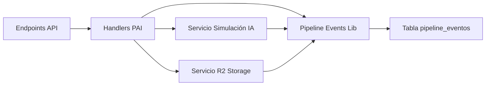

# Integración de Pipeline Events - Proyectos PAI
## Backend - Core Funcional

**Versión:** 1.0
**Fecha:** 27 de marzo de 2026
**Propósito:** Especificación de cómo integrar el sistema de pipeline events en las operaciones PAI

---

## Índice

1. [Propósito](#1-propósito)
2. [Arquitectura de Integración](#2-arquitectura-de-integración)
3. [Mapeo de Operaciones a Eventos](#3-mapeo-de-operaciones-a-eventos)
4. [Estados Automáticos vs Eventos](#4-estados-automáticos-vs-eventos)
5. [Estrategia de Trazabilidad](#5-estrategia-de-trazabilidad)
6. [Ejemplos de Implementación](#6-ejemplos-de-implementación)
7. [Referencias](#7-referencias)

---

## 1. Propósito

Este documento define la estrategia de integración del sistema de pipeline events en las operaciones PAI, proporcionando trazabilidad completa de todas las acciones realizadas sobre proyectos de análisis inmobiliario.

El sistema de pipeline events ya está implementado en [`apps/worker/src/lib/pipeline-events.ts`](../../../apps/worker/src/lib/pipeline-events.ts) como parte del Starter Kit de auditoría.

---

## 2. Arquitectura de Integración

### 2.1. Componentes



### 2.2. Uso de Librería Pipeline Events

```typescript
import {
  insertPipelineEvent,
  getEntityEvents,
  getLatestEvent,
  getErrorEvents,
  getStepDurationMetrics,
  getEventCountByType,
} from '../lib/pipeline-events'
```

### 2.3. Convención de Entity ID

Para todas las operaciones PAI, se usa la siguiente convención para `entityId`:

```typescript
const entityId = `proyecto-${proyectoId}`
```

---

## 3. Mapeo de Operaciones a Eventos

### 3.1. Crear Proyecto

| Paso | Tipo Evento | Nivel | Descripción |
|-------|--------------|--------|-------------|
| Inicio | `PROCESS_START` | `INFO` | Inicio del proceso de creación de proyecto |
| Validación IJSON | `STEP_SUCCESS` | `INFO` | IJSON validado y parseado correctamente |
| Guardar IJSON | `STEP_SUCCESS` | `INFO` | IJSON guardado en R2 |
| Crear registro DB | `STEP_SUCCESS` | `INFO` | Registro creado en PAI_PRO_proyectos |
| Finalización | `PROCESS_COMPLETE` | `INFO` | Proyecto creado exitosamente |

### 3.2. Ejecutar Análisis

| Paso | Tipo Evento | Nivel | Descripción |
|-------|--------------|--------|-------------|
| Inicio | `PROCESS_START` | `INFO` | Inicio del proceso de análisis |
| Validación IJSON | `STEP_SUCCESS` | `INFO` | IJSON validado para análisis |
| Generar Análisis Físico | `STEP_SUCCESS` | `INFO` | Análisis físico generado |
| Generar Análisis Estratégico | `STEP_SUCCESS` | `INFO` | Análisis estratégico generado |
| Generar Análisis Financiero | `STEP_SUCCESS` | `INFO` | Análisis financiero generado |
| Generar Análisis Regulatorio | `STEP_SUCCESS` | `INFO` | Análisis regulatorio generado |
| Generar Lecturas | `STEP_SUCCESS` | `INFO` | Lecturas generadas |
| Guardar Artefactos | `STEP_SUCCESS` | `INFO` | Artefactos guardados en R2 |
| Actualizar Estado | `STEP_SUCCESS` | `INFO` | Estado actualizado a ANALISIS_FINALIZADO |
| Finalización | `PROCESS_COMPLETE` | `INFO` | Análisis completado exitosamente |

### 3.3. Crear Nota

| Paso | Tipo Evento | Nivel | Descripción |
|-------|--------------|--------|-------------|
| Inicio | `PROCESS_START` | `INFO` | Inicio del proceso de creación de nota |
| Validar Tipo Nota | `STEP_SUCCESS` | `INFO` | Tipo de nota validado |
| Insertar Registro DB | `STEP_SUCCESS` | `INFO` | Nota insertada en PAI_NOT_notas |
| Finalización | `PROCESS_COMPLETE` | `INFO` | Nota creada exitosamente |

### 3.4. Editar Nota

| Paso | Tipo Evento | Nivel | Descripción |
|-------|--------------|--------|-------------|
| Inicio | `PROCESS_START` | `INFO` | Inicio del proceso de edición de nota |
| Validar Editabilidad | `STEP_SUCCESS` | `INFO` | Editabilidad validada contra estado actual |
| Actualizar Registro DB | `STEP_SUCCESS` | `INFO` | Nota actualizada en PAI_NOT_notas |
| Finalización | `PROCESS_COMPLETE` | `INFO` | Nota editada exitosamente |

### 3.5. Cambiar Estado Manual

| Paso | Tipo Evento | Nivel | Descripción |
|-------|--------------|--------|-------------|
| Inicio | `PROCESS_START` | `INFO` | Inicio del proceso de cambio de estado |
| Validar Estado | `STEP_SUCCESS` | `INFO` | Estado validado |
| Actualizar Registro DB | `STEP_SUCCESS` | `INFO` | Estado actualizado en PAI_PRO_proyectos |
| Finalización | `PROCESS_COMPLETE` | `INFO` | Estado cambiado exitosamente |

### 3.6. Eliminar Proyecto

| Paso | Tipo Evento | Nivel | Descripción |
|-------|--------------|--------|-------------|
| Inicio | `PROCESS_START` | `INFO` | Inicio del proceso de eliminación |
| Eliminar Notas | `STEP_SUCCESS` | `INFO` | Notas eliminadas de PAI_NOT_notas |
| Eliminar Artefactos | `STEP_SUCCESS` | `INFO` | Artefactos eliminados de PAI_ART_artefactos |
| Eliminar Carpeta R2 | `STEP_SUCCESS` | `INFO` | Carpeta eliminada de R2 |
| Eliminar Registro DB | `STEP_SUCCESS` | `INFO` | Proyecto eliminado de PAI_PRO_proyectos |
| Finalización | `PROCESS_COMPLETE` | `INFO` | Eliminación completada exitosamente |

---

## 4. Estados Automáticos vs Eventos

### 4.1. Estados Automáticos

Los siguientes estados son asignados automáticamente por el sistema:

| Estado ID | Estado | Cuándo se Asigna | Evento Asociado |
|-----------|-------|-------------------|-------------------|
| 1 | `NUEVO` | Al crear el proyecto | `PROCESS_START` + `PROCESS_COMPLETE` |
| 2 | `EN_ANALISIS` | Al iniciar análisis | `PROCESS_START` |
| 3 | `PENDIENTE_REVISION` | Al finalizar análisis | `STEP_SUCCESS` + `PROCESS_COMPLETE` |
| 4 | `ANALISIS_CON_ERROR` | Si hay error en análisis | `STEP_FAILED` + `PROCESS_FAILED` |

### 4.2. Estados Manuales

Los siguientes estados son asignados manualmente por el usuario:

| Estado ID | Estado | Cuándo se Asigna | Evento Asociado |
|-----------|-------|-------------------|-------------------|
| 5 | `EVALUANDO_VIABILIDAD` | Usuario cambia estado | `STEP_SUCCESS` + `PROCESS_COMPLETE` |
| 6 | `EVALUANDO_PLAN_NEGOCIO` | Usuario cambia estado | `STEP_SUCCESS` + `PROCESS_COMPLETE` |
| 7 | `SEGUIMIENTO_COMERCIAL` | Usuario cambia estado | `STEP_SUCCESS` + `PROCESS_COMPLETE` |
| 8 | `APROBADO` | Usuario cambia estado | `STEP_SUCCESS` + `PROCESS_COMPLETE` |
| 9 | `RECHAZADO` | Usuario cambia estado | `STEP_SUCCESS` + `PROCESS_COMPLETE` |

### 4.3. Mapeo de Cambios de Estado

Cada cambio de estado debe registrarse como evento:

```typescript
await insertPipelineEvent(db, {
  entityId: `proyecto-${proyectoId}`,
  paso: 'cambiar_estado',
  nivel: 'INFO',
  tipoEvento: 'STEP_SUCCESS',
  detalle: {
    estado_anterior: estadoAnterior,
    estado_nuevo: estadoNuevo,
    motivo: motivoValoracionId || motivoDescarteId,
  },
})
```

---

## 5. Estrategia de Trazabilidad

### 5.1. Principios de Trazabilidad

1. **Trazabilidad Completa** - Cada operación significativa debe registrar eventos
2. **Cronología Preservada** - Los eventos deben mantener el orden temporal
3. **Detalle Suficiente** - Los eventos deben incluir suficiente contexto para debugging
4. **Errores Registrados** - Todos los errores deben registrarse con nivel `ERROR`

### 5.2. Control de Editabilidad de Notas

Según el concepto del proyecto, una nota solo puede editarse mientras siga vigente el estado con el que fue creada.

**Implementación:**

```typescript
async function validarEditabilidadNota(
  db: D1Database,
  notaId: number,
  proyectoId: number,
): Promise<{ editable: boolean, razon?: string }> {
  // Obtener nota
  const nota = await db
    .prepare('SELECT * FROM PAI_NOT_notas WHERE id = ?')
    .bind(notaId)
    .first()
  
  if (!nota) {
    return { editable: false, razon: 'Nota no encontrada' }
  }
  
  // Obtener estado actual del proyecto
  const proyecto = await db
    .prepare('SELECT estado_id FROM PAI_PRO_proyectos WHERE id = ?')
    .bind(proyectoId)
    .first()
  
  if (!proyecto) {
    return { editable: false, razon: 'Proyecto no encontrado' }
  }
  
  // Obtener historial de cambios de estado
  const eventos = await getEntityEvents(db, `proyecto-${proyectoId}`)
  
  // Buscar el último cambio de estado
  const ultimoCambioEstado = [...eventos]
    .reverse()
    .find(e => e.paso === 'cambiar_estado')
  
  if (!ultimoCambioEstado) {
    // No ha habido cambios de estado, la nota es editable
    return { editable: true }
  }
  
  // Verificar si el estado actual es el mismo que cuando se creó la nota
  const notaCreada = await db
    .prepare('SELECT created_at FROM PAI_NOT_notas WHERE id = ?')
    .bind(notaId)
    .first()
  
  if (ultimoCambioEstado.created_at > notaCreada.created_at) {
    return { editable: false, razon: 'El estado del proyecto cambió desde que se creó la nota' }
  }
  
  return { editable: true }
}
```

### 5.3. Consulta de Historial de Ejecución

Para obtener el historial completo de ejecución de un proyecto:

```typescript
const eventos = await getEntityEvents(db, `proyecto-${proyectoId}`, {
  limit: 100,
  order: 'ASC',
})

// Los eventos se pueden agrupar por paso para mostrar una cronología clara
```

---

## 6. Ejemplos de Implementación

### 6.1. Ejemplo: Crear Proyecto con Trazabilidad

```typescript
export async function crearProyectoConTrazabilidad(
  env: Env,
  db: D1Database,
  ijson: string,
): Promise<ProyectoCreado> {
  const entityId = `proyecto-${Date.now()}`
  
  try {
    // Iniciar proceso
    await insertPipelineEvent(db, {
      entityId,
      paso: 'crear_proyecto',
      nivel: 'INFO',
      tipoEvento: 'PROCESS_START',
      detalle: 'Iniciando creación de proyecto',
    })
    
    // Validar IJSON
    const ijsonValidado = validarIJSON(ijson)
    await insertPipelineEvent(db, {
      entityId,
      paso: 'validar_ijson',
      nivel: 'INFO',
      tipoEvento: 'STEP_SUCCESS',
      detalle: 'IJSON validado correctamente',
    })
    
    // Crear registro en DB
    const proyecto = await insertarProyecto(db, ijsonValidado)
    await insertPipelineEvent(db, {
      entityId,
      paso: 'crear_registro_db',
      nivel: 'INFO',
      tipoEvento: 'STEP_SUCCESS',
      detalle: 'Proyecto creado en base de datos',
    })
    
    // Finalizar proceso
    await insertPipelineEvent(db, {
      entityId,
      paso: 'crear_proyecto',
      nivel: 'INFO',
      tipoEvento: 'PROCESS_COMPLETE',
      detalle: 'Proyecto creado exitosamente',
    })
    
    return { exito: true, proyecto }
  } catch (error) {
    await insertPipelineEvent(db, {
      entityId,
      paso: 'crear_proyecto',
      nivel: 'ERROR',
      tipoEvento: 'PROCESS_FAILED',
      errorCodigo: 'ERROR_CREAR_PROYECTO',
      detalle: error instanceof Error ? error.message : 'Error desconocido',
    })
    
    throw error
  }
}
```

### 6.2. Ejemplo: Ejecutar Análisis con Trazabilidad

```typescript
export async function ejecutarAnalisisConTrazabilidad(
  env: Env,
  db: D1Database,
  proyectoId: number,
  ijson: string,
): Promise<AnalisisResultado> {
  const entityId = `proyecto-${proyectoId}`
  
  try {
    // Iniciar proceso
    await insertPipelineEvent(db, {
      entityId,
      paso: 'ejecutar_analisis',
      nivel: 'INFO',
      tipoEvento: 'PROCESS_START',
      detalle: 'Iniciando análisis completo',
    })
    
    // Generar análisis
    const resultado = await generarAnalisisSimulado(env, db, proyectoId, ijson)
    
    if (resultado.exito) {
      await insertPipelineEvent(db, {
        entityId,
        paso: 'generar_analisis',
        nivel: 'INFO',
        tipoEvento: 'STEP_SUCCESS',
        detalle: 'Análisis generado exitosamente',
      })
    } else {
      await insertPipelineEvent(db, {
        entityId,
        paso: 'generar_analisis',
        nivel: 'ERROR',
        tipoEvento: 'STEP_FAILED',
        errorCodigo: resultado.error_codigo,
        detalle: resultado.error_mensaje,
      })
    }
    
    return resultado
  } catch (error) {
    await insertPipelineEvent(db, {
      entityId,
      paso: 'ejecutar_analisis',
      nivel: 'ERROR',
      tipoEvento: 'PROCESS_FAILED',
      errorCodigo: 'ERROR_ANALISIS_INESPERADO',
      detalle: error instanceof Error ? error.message : 'Error desconocido',
    })
    
    throw error
  }
}
```

---

## 7. Referencias

### 7.1. Documentos del Proyecto

- [`DocumentoConceptoProyecto _PAI.md`](../../doc-base/DocumentoConceptoProyecto _PAI.md) - Concepto del proyecto y flujo funcional
- [`R02_MapadeRuta_PAI.md`](../../comunicacion/R02_MapadeRuta_PAI.md) - Mapa de ruta actualizado

### 7.2. Librerías Implementadas

- [`apps/worker/src/lib/pipeline-events.ts`](../../../apps/worker/src/lib/pipeline-events.ts) - Librería de funciones para pipeline events
- [`apps/worker/src/lib/r2-storage.ts`](../../../apps/worker/src/lib/r2-storage.ts) - Librería de funciones para R2 storage

### 7.3. Reglas del Proyecto

- [`.governance/reglas_proyecto.md`](../../../../.governance/reglas_proyecto.md) - Reglas del proyecto
  - R1: No asumir valores no documentados
  - R2: Cero hardcoding

### 7.4. Migraciones de Base de Datos

- [`migrations/003-pipeline-events.sql`](../../../migrations/003-pipeline-events.sql) - Tabla pipeline_eventos
- [`migrations/004-pai-mvp.sql`](../../../migrations/004-pai-mvp.sql) - Tablas PAI (PRO, ATR, VAL, NOT, ART)

### 7.5. Starter Kit

- [`plans/pipeline-eventos-starter-kit/`](../../../pipeline-eventos-starter-kit/00-RESUMEN.md) - Starter Kit de auditoría de eventos
