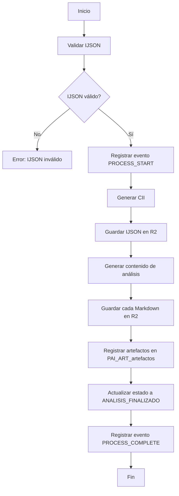

# Servicio de Simulación de IA - Proyectos PAI
## Backend - Core Funcional

**Versión:** 1.0
**Fecha:** 27 de marzo de 2026
**Propósito:** Especificación del servicio de simulación de IA que genera los 10 archivos Markdown en R2

---

## Índice

1. [Propósito](#1-propósito)
2. [Arquitectura del Servicio](#2-arquitectura-del-servicio)
3. [Tipos de Análisis](#3-tipos-de-análisis)
4. [Formato de Archivos Markdown](#4-formato-de-archivos-markdown)
5. [Funciones del Servicio](#5-funciones-del-servicio)
6. [Integración con R2 Storage](#6-integración-con-r2-storage)
7. [Manejo de Errores](#7-manejo-de-errores)
8. [Referencias](#8-referencias)

---

## 1. Propósito

El servicio de simulación de IA tiene como objetivo generar los 10 archivos Markdown de análisis para un proyecto PAI, simulando el comportamiento de una API de IA real. Este servicio permite avanzar con el desarrollo del sistema PAI sin depender de integraciones externas.

**NOTA:** Según las respuestas del usuario en [`R01.md`](../../comunicacion/R01.md), la integración con IA real se pospone hasta que PAI esté plenamente desarrollado.

---

## 2. Arquitectura del Servicio

### 2.1. Ubicación

- **Archivo:** `apps/worker/src/services/simulacion-ia.ts`
- **Exporta:** Funciones para generar contenido de análisis simulado

### 2.2. Dependencias

```typescript
import { getR2Bucket } from '../env'
import type { Env } from '../env'
import {
  generateCII,
  generateProjectFolderStructure,
  saveIJSON,
  saveMarkdownArtifact,
  saveAllMarkdownArtifacts,
  generateSimulatedAnalysisContent,
} from '../lib/r2-storage'
import {
  insertPipelineEvent,
  getEntityEvents,
} from '../lib/pipeline-events'
```

### 2.3. Constantes

```typescript
const ANALYSIS_TIMEOUT_MS = 30000 // 30 segundos máximo para análisis
const MAX_RETRIES = 3
```

---

## 3. Tipos de Análisis

El servicio genera 10 tipos de análisis, cada uno en un archivo Markdown separado:

| Tipo | Archivo | Descripción |
|-------|-----------|-------------|
| `resumen-ejecutivo` | `CII_resumen-ejecutivo.md` | Resumen ejecutivo del análisis |
| `datos-transformados` | `CII_datos-transformados.md` | Datos del IJSON transformados y estructurados |
| `analisis-fisico` | `CII_analisis-fisico.md` | Análisis físico del inmueble |
| `analisis-estrategico` | `CII_analisis-estrategico.md` | Análisis estratégico del inmueble |
| `analisis-financiero` | `CII_analisis-financiero.md` | Análisis financiero del inmueble |
| `analisis-regulatorio` | `CII_analisis-regulatorio.md` | Análisis regulatorio del inmueble |
| `lectura-inversor` | `CII_lectura-inversor.md` | Lectura del análisis para perfil inversor |
| `lectura-operador` | `CII_lectura-operador.md` | Lectura del análisis para perfil operador |
| `lectura-propietario` | `CII_lectura-propietario.md` | Lectura del análisis para perfil propietario |

---

## 4. Formato de Archivos Markdown

### 4.1. Estructura General

Cada archivo Markdown sigue esta estructura:

```markdown
# [Título del Análisis] - [CII]

## [Sección 1]
[Contenido...]

## [Sección 2]
[Contenido...]

## [Sección 3]
[Contenido...]

## Observaciones
[Comentarios finales...]
```

### 4.2. Metadatos del Archivo

Cada archivo generado incluye metadatos en R2:

```typescript
const metadata = {
  tipo: 'ANALISIS_FISICO', // Tipo de artefacto
  cii: '26010001',          // Código Id de Inmueble
  proyecto_id: 123,           // ID del proyecto
  fecha_generacion: new Date().toISOString(),
}
```

---

## 5. Funciones del Servicio

### 5.1. Función Principal

```typescript
/**
 * Ejecuta el análisis completo de un proyecto PAI
 * Genera los 10 archivos Markdown en R2
 *
 * @param env - Environment bindings
 * @param db - D1 database instance
 * @param proyectoId - ID del proyecto PAI
 * @param ijson - Contenido del IJSON (JSON string)
 * @returns Promise con resultado del análisis
 */
export async function ejecutarAnalisisCompleto(
  env: Env,
  db: D1Database,
  proyectoId: number,
  ijson: string,
): Promise<AnalisisResultado>
```

### 5.2. Flujo de Ejecución



### 5.3. Validación de IJSON

```typescript
function validarIJSON(ijson: string): IJSONValidacion {
  try {
    const parsed = JSON.parse(ijson)
    
    // Validar campos obligatorios
    if (!parsed.titulo_anuncio) {
      return { valido: false, error: 'Falta campo titulo_anuncio' }
    }
    if (!parsed.tipo_inmueble) {
      return { valido: false, error: 'Falta campo tipo_inmueble' }
    }
    if (!parsed.precio) {
      return { valido: false, error: 'Falta campo precio' }
    }
    
    return { valido: true, ijson: parsed }
  } catch (error) {
    return { valido: false, error: 'JSON inválido' }
  }
}
```

---

## 6. Integración con R2 Storage

### 6.1. Uso de Librería R2 Storage

El servicio utiliza las funciones de la librería [`r2-storage.ts`](../../../apps/worker/src/lib/r2-storage.ts):

```typescript
import {
  generateCII,
  generateProjectFolderStructure,
  saveIJSON,
  saveAllMarkdownArtifacts,
} from '../lib/r2-storage'
```

### 6.2. Flujo de Almacenamiento

```typescript
// 1. Generar CII
const cii = generateCII(proyectoId)

// 2. Generar estructura de carpetas
const folderStructure = generateProjectFolderStructure(cii)

// 3. Guardar IJSON original
await saveIJSON(r2Bucket, cii, ijson)

// 4. Generar contenido de análisis
const ijsonParsed = JSON.parse(ijson)
const markdownContents = generateSimulatedAnalysisContent(cii, ijsonParsed)

// 5. Guardar todos los Markdown
const resultados = await saveAllMarkdownArtifacts(r2Bucket, cii, markdownContents)
```

### 6.3. Estructura de Carpetas en R2

```
analisis-inmuebles/
└── 26010001/                    # CII
    ├── 26010001.json            # IJSON original
    ├── 26010001_resumen-ejecutivo.md
    ├── 26010001_datos-transformados.md
    ├── 26010001_analisis-fisico.md
    ├── 26010001_analisis-estrategico.md
    ├── 26010001_analisis-financiero.md
    ├── 26010001_analisis-regulatorio.md
    ├── 26010001_lectura-inversor.md
    ├── 26010001_lectura-operador.md
    └── 26010001_lectura-propietario.md
```

---

## 7. Manejo de Errores

### 7.1. Tipos de Errores

| Tipo | Código | Descripción | Acción |
|-------|---------|-------------|---------|
| `IJSON_INVALIDO` | `INVALID_IJSON` | El IJSON no es un JSON válido o falta campos obligatorios | Error 400 |
| `ERROR_R2_GUARDAR` | `R2_SAVE_ERROR` | Error al guardar archivo en R2 | Error 500 |
| `ERROR_R2_LEER` | `R2_READ_ERROR` | Error al leer archivo de R2 | Error 500 |
| `ERROR_DB_INSERT` | `DB_INSERT_ERROR` | Error al insertar en base de datos | Error 500 |
| `TIMEOUT_ANALISIS` | `ANALYSIS_TIMEOUT` | El análisis excedió el tiempo máximo | Error 500 |

### 7.2. Estrategia de Reintentos

```typescript
async function ejecutarConReintento<T>(
  operacion: () => Promise<T>,
  maxReintentos: number = MAX_RETRIES,
): Promise<T> {
  let ultimoError: Error | null = null
  
  for (let intento = 1; intento <= maxReintentos; intento++) {
    try {
      return await operacion()
    } catch (error) {
      ultimoError = error as Error
      if (intento < maxReintentos) {
        // Esperar antes de reintentar
        await new Promise(resolve => setTimeout(resolve, 1000 * intento))
      }
    }
  }
  
  throw ultimoError
}
```

---

## 8. Referencias

### 8.1. Documentos del Proyecto

- [`DocumentoConceptoProyecto _PAI.md`](../../doc-base/DocumentoConceptoProyecto _PAI.md) - Concepto del proyecto y flujo funcional
- [`Sistema-Identificacion-Almacenamiento-Inmueble.md`](../../doc-base/Sistema-Identificacion-Almacenamiento-Inmueble.md) - Sistema de identificación CII
- [`Ejemplo-modelo-info.json`](../../doc-base/Ejemplo-modelo-info.json) - Ejemplo de IJSON

### 8.2. Librerías Implementadas

- [`apps/worker/src/lib/r2-storage.ts`](../../../apps/worker/src/lib/r2-storage.ts) - Librería de funciones para R2 storage
- [`apps/worker/src/lib/pipeline-events.ts`](../../../apps/worker/src/lib/pipeline-events.ts) - Librería de funciones para pipeline events

### 8.3. Reglas del Proyecto

- [`.governance/reglas_proyecto.md`](../../../../.governance/reglas_proyecto.md) - Reglas del proyecto
  - R1: No asumir valores no documentados
  - R2: Cero hardcoding
  - R4: Accesores tipados para bindings

### 8.4. Migraciones de Base de Datos

- [`migrations/004-pai-mvp.sql`](../../../migrations/004-pai-mvp.sql) - Tablas PAI (PRO, ATR, VAL, NOT, ART)
- [`migrations/005-pai-mvp-datos-iniciales.sql`](../../../migrations/005-pai-mvp-datos-iniciales.sql) - Datos iniciales PAI

---

## 9. Ejemplos de Uso

### 9.1. Ejemplo Básico

```typescript
import { ejecutarAnalisisCompleto } from '../services/simulacion-ia'

const resultado = await ejecutarAnalisisCompleto(
  env,
  db,
  proyectoId,
  ijson,
)

if (resultado.exito) {
  console.log('Análisis completado:', resultado.artefactos_generados)
} else {
  console.error('Error en análisis:', resultado.error)
}
```

### 9.2. Ejemplo con Manejo de Errores

```typescript
try {
  const resultado = await ejecutarAnalisisCompleto(
    env,
    db,
    proyectoId,
    ijson,
  )
  
  if (!resultado.exito) {
    // Registrar error en pipeline events
    await insertPipelineEvent(db, {
      entityId: `proyecto-${proyectoId}`,
      paso: 'ejecutar_analisis',
      nivel: 'ERROR',
      tipoEvento: 'STEP_FAILED',
      errorCodigo: resultado.error_codigo,
      detalle: resultado.error_mensaje,
    })
  }
} catch (error) {
  console.error('Error inesperado:', error)
}
```
