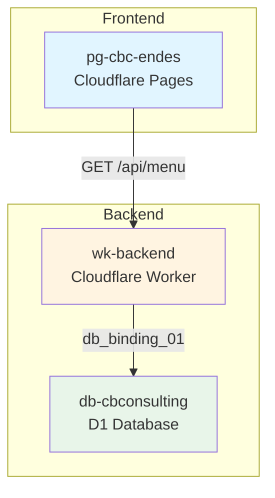

# Plan de Actualización del Inventario de Recursos
## Menú Dinámico v1

> **Fecha de creación:** 2026-03-27
> **Proyecto:** cbc-endes
> **Objetivo:** Actualizar el inventario de recursos con los nuevos recursos creados durante el despliegue del menú dinámico v1

---

## Resumen

Este plan detalla las actualizaciones necesarias en [`.governance/inventario_recursos.md`](../.governance/inventario_recursos.md) para incorporar los nuevos recursos Cloudflare creados durante el despliegue del menú dinámico v1.

---

## Recursos Nuevos a Incorporar

### 1. Worker: `wk-backend`

| Atributo | Valor |
|----------|-------|
| **Nombre** | `wk-backend` |
| **Nombre dev** | `wk-backend-dev` |
| **URL** | https://wk-backend-dev.cbconsulting.workers.dev |
| **Estado** | ✅ Activo |
| **Puerto Dev** | 8787 |
| **App/Proyecto** | Backend API (dev) |
| **Último Deploy** | 2026-03-27 |
| **Notas** | Implementación de menú dinámico v1 como base para siguientes fases |

**Endpoints implementados:**
- `GET /api/health` - Health check del servicio
- `GET /api/test` - Test endpoint
- `GET /api/menu` - Endpoint para obtener estructura de menú dinámico

### 2. D1 Database: `db-cbconsulting`

| Atributo | Valor |
|----------|-------|
| **Nombre** | `db-cbconsulting` |
| **ID** | `fafcd5e2-b960-49f7-8502-88a0f8ba5052` |
| **Binding** | `db_binding_01` |
| **Estado** | ✅ Activo |
| **App** | `wk-backend` |
| **Notas** | Base de datos para configuración de menú dinámico |

**Tablas creadas:**
- `MOD_modulos_config` - Tabla principal de configuración de menú

**Migración aplicada:**
- [`migrations/002-menu-dinamico-v1.sql`](../migrations/002-menu-dinamico-v1.sql)

### 3. Binding: `db_binding_01`

| Atributo | Valor |
|----------|-------|
| **Nombre** | `db_binding_01` |
| **Tipo** | D1 Database |
| **Estado** | ✅ Activo |
| **Ubicación** | `apps/worker/wrangler.toml` |
| **Observaciones** | Binding tipado en `apps/worker/src/env.ts` (R4: Accesores tipados) |

---

## Secciones del Inventario a Actualizar

### 4.1 Workers (Sección 4.1)

**Cambio:** Reemplazar la nota actual y añadir el nuevo Worker.

**Entrada nueva:**

| Nombre | Binding | App/Proyecto | Puerto Dev | Estado CF | Último Deploy | Notas |
|--------|---------|--------------|------------|-----------|---------------|-------|
| `wk-backend` | `db_binding_01` | Backend API (dev) | 8787 | ✅ | 2026-03-27 | Menú dinámico v1 |

**Nota actualizada:**
- El Worker `wk-backend` está activo y proporciona endpoints para el menú dinámico.
- El Worker de prueba `worker-cbc-endes-dev` fue eliminado el 2026-03-27.

### 4.3 Bases de Datos (D1) (Sección 4.3)

**Cambio:** Reemplazar la nota actual y añadir la nueva D1 Database.

**Entrada nueva:**

| Nombre | Binding | App | ID | Estado | Notas |
|--------|---------|-----|----|--------|-------|
| `db-cbconsulting` | `db_binding_01` | `wk-backend` | `fafcd5e2-b960-49f7-8502-88a0f8ba5052` | ✅ | Menú dinámico v1 |

**Nota actualizada:**
- La D1 Database `db-cbconsulting` está activa y contiene la tabla `MOD_modulos_config`.
- La base de datos de prueba `cbc-endes-db-test` fue eliminada el 2026-03-27.

### 5.1 Bindings y Variables de Entorno (Sección 5.1)

**Cambio:** Añadir el binding `db_binding_01` y actualizar notas.

**Entrada nueva:**

| Clave o Binding | Tipo | Estado | Ubicación | Observaciones |
|-----------------|------|--------|-----------|---------------|
| `db_binding_01` | D1 Database | ✅ | `apps/worker/wrangler.toml` | Binding para `db-cbconsulting` |
| `DB` | D1 Database | ❌ Eliminado | - | Binding eliminado (D1 eliminada) |
| `BUCKET` | R2 Bucket | ❌ Eliminado | - | Binding eliminado (R2 eliminado) |
| `VITE_API_BASE_URL` | Variable frontend | ✅ | `apps/frontend/wrangler.toml` | URL de la API backend |
| `VITE_ENVIRONMENT` | Variable frontend | ✅ | `apps/frontend/wrangler.toml` | Entorno de ejecución |

### 8. Contratos entre Servicios (Sección 8)

**Cambio:** Actualizar la tabla de contratos y añadir el nuevo endpoint.

**Tabla actualizada:**

| Servicio Origen | Servicio Destino | Endpoint | Método | Request | Response | Estado |
|-----------------|------------------|----------|--------|---------|----------|--------|
| Frontend (Pages) | `wk-backend` | `/api/menu` | GET | Ninguno | JSON con estructura de menú agrupada por módulos | ✅ |

**Endpoints del Worker actualizados:**

| Endpoint | Método | Descripción | Response | Estado |
|----------|--------|-------------|----------|--------|
| `/api/health` | GET | Health check del servicio | `{ status: "ok", timestamp, service, version }` | ✅ |
| `/api/test` | GET | Test endpoint de disponibilidad | `{ message, hono, typescript }` | ✅ |
| `/api/menu` | GET | Obtiene estructura de menú dinámico | `{ modulos: [...] }` con módulos y funciones | ✅ |

### 13. Historial de Cambios (Sección 13)

**Cambio:** Añadir nueva entrada al historial.

**Nueva entrada:**

| Fecha | Cambio | Responsable | Aprobado Por |
|-------|--------|-------------|--------------|
| 2026-03-27 | Despliegue de menú dinámico v1: Worker `wk-backend`, D1 `db-cbconsulting`, binding `db_binding_01`, endpoint `/api/menu` | inventariador | usuario |

---

## Archivos Referenciados

| Archivo | Finalidad |
|---------|-----------|
| [`apps/worker/wrangler.toml`](../apps/worker/wrangler.toml) | Configuración del Worker con binding D1 |
| [`apps/worker/src/env.ts`](../apps/worker/src/env.ts) | Módulo de configuración de entorno con accesor tipado (R4) |
| [`apps/worker/src/handlers/menu.ts`](../apps/worker/src/handlers/menu.ts) | Handler del endpoint `/api/menu` |
| [`apps/worker/src/index.ts`](../apps/worker/src/index.ts) | Router actualizado con nuevo endpoint |
| [`migrations/002-menu-dinamico-v1.sql`](../migrations/002-menu-dinamico-v1.sql) | Migración SQL para tabla `MOD_modulos_config` |

---

## Reglas del Proyecto Aplicadas

| Regla | Aplicación |
|-------|------------|
| R1 | No asumir valores no documentados (todos los nombres de recursos fueron especificados por el usuario) |
| R2 | Cero hardcoding (se usaron variables de entorno y bindings) |
| R4 | Accesores tipados para bindings (se creó módulo [`env.ts`](../apps/worker/src/env.ts)) |
| R8 | Configuración de despliegue (se usó [`wrangler.toml`](../apps/worker/wrangler.toml) sin account_id) |
| R9 | Migraciones de esquema de base de datos (se usó archivo de migración numerado) |
| R15 | Solo el agente inventariador puede modificar el inventario |

---

## Diagrama de Arquitectura

---

## Validaciones a Realizar

1. ✅ Verificar que el Worker `wk-backend` existe en Cloudflare
2. ✅ Verificar que la D1 Database `db-cbconsulting` existe en Cloudflare
3. ✅ Verificar que el binding `db_binding_01` está configurado correctamente
4. ✅ Verificar que el endpoint `/api/menu` responde correctamente
5. ✅ Verificar coherencia con el código en el repositorio

---

## Próximos Pasos

Una vez aprobado este plan:

1. El agente `inventariador` ejecutará las actualizaciones en [`.governance/inventario_recursos.md`](../.governance/inventario_recursos.md)
2. Se validará la coherencia del inventario actualizado
3. Se notificará al usuario de la finalización de la actualización

---

> **Nota:** Este plan sigue las reglas del proyecto, especialmente la R15 que establece que solo el agente `inventariador` tiene permiso para modificar el inventario de recursos.
